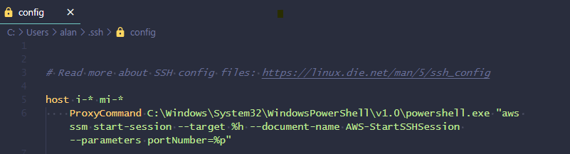
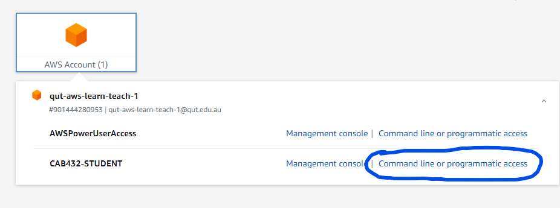

#### Section Overview

`Note: This guide maybe useful if you dont have VSCode installed on your local device and only using a shell interface.`. Using something like Putty / VSCode may save some headache.

In the QUT AWS Cloud environment we can use AWS System Manager component session manager to enable connectivity to a Virtual Machine's command line. This tunnel can also be used to transfer files.

- This guide demonstrates how to perform these tasks on Windows local 
- There are two shells this process will work for - Bash & PowerShell 

#### References

- [AWS Systems manager](https://aws.amazon.com/systems-manager/features/#Session_Manager)
- [Session Manager](https://docs.aws.amazon.com/systems-manager/latest/userguide/session-manager-working-with-sessions-start.html#sessions-start-cli )
- [SSH Connection](https://docs.aws.amazon.com/systems-manager/latest/userguide/session-manager-getting-started-enable-ssh-connections.html )
- [Port Forwarding](https://aws.amazon.com/blogs/aws/new-port-forwarding-using-aws-system-manager-sessions-manager/)

#### Prerequisites

- **Access Key**: When you build the VM you wish to connect to in this manner you must download the Access key (.pem file) during the build process
- **AWS CLI**: If you haven't already download & install on your local: [https://docs.aws.amazon.com/cli/latest/userguide/install-cliv2.html](https://docs.aws.amazon.com/cli/latest/userguide/install-cliv2.html)
- **AWS SSM Plugin**: If you haven't already download & install on your local: [https://docs.aws.amazon.com/systems-manager/latest/userguide/session-manager-working-with-install-plugin.html](https://docs.aws.amazon.com/systems-manager/latest/userguide/session-manager-working-with-install-plugin.html)

#### How-To Guide

1. To enable this service first you have to create a configuration file on your local device. You can add both the Bash & the PowerShell commands into the configuration file but there is an order of precedence with a depth of 1 that means only the first command listed is the one that is read the other is ignored.

so you must put the one you intend to use first! 

- You may need to create a new file in this folder location 
- the file needs to be called "config"
- copy the code block from below

**Config Code for PowerShell**

~~~~
# Folder Location:	
C:\Users\<username>\.ssh
# SSH over Session Manager
host i-* mi-*
    ProxyCommand C:\Windows\System32\WindowsPowerShell\v1.0\powershell.exe "aws ssm start-session --target %h --document-name AWS-StartSSHSession --parameters portNumber=%p"
~~~~

**Config Code for Bash**

~~~~
# Folder Location:	
# C:\Users\<username>\.ssh
# SSH over Session Manager
host i-* mi-*
    ProxyCommand sh -c "aws ssm start-session --target %h --document-name AWS-StartSSHSession --parameters 'portNumber=%p'"
~~~~

If you inspect this file with VSCode/IDE for example, you might get something likes of this:

1. Connecting from your local device.

- Take note of where your .pem file is located (in the example it is in our downloads folder)
- Take note of what you named your .pem file 
- Take note of the Public DNS Record for the VM you are connecting to 
- Open either your Bash or PowerShell shell
- Type the ssh command 

**Config Code for Powershell**

~~~~
ssh -i C:\Users\<username>\Downloads\<nameOfPemFile>.pem ubuntu@PublicDNSRecord
~~~~

A Sample to do this is: 

~~~~
ssh -i "C:\Users\alan\Downloads\yu39-key.pem" ubuntu@ec2-3-26-199-141.ap-southeast-2.compute.amazonaws.com
~~~~

**Config Code for Bash**

~~~~
ssh -i /c/Users/<username>/Downloads/<nameOfPemFile>.pem ubuntu@PublicDNSRecord
~~~~

3. Transferring files from your local device

- Take note of where your .pem file is located (in the example - it is in our downloads folder)
- Take note of what you named your .pem file 
- Take note of the instance id for the VM you are connecting to 
- Take note of the location the file you want to copy is on your local
- Take note of the location you want the file to go on the VM 
- Open either your Bash or PowerShell shell
- Type the scp command 

**Config Code for PowerShell**

~~~~
scp -i C:\user\<username>\Downloads\<nameOfPemFile>.pem C:\Users\<username>\Downloads\<nameOfFiletoCopy> ubuntu@PublicDNSRecord:~<directoryName><fileName>
~~~~

**Config Code for Bash**

~~~~
scp -i /c/user/<username>/Downloads/<nameOfPemFile>.pem ubuntu@PublicDNSRecord
c/Users/<username>/Downloads/<nameOfFiletoCopy>
~~~~

#### Common errors

- For linux users, you might need to use `chmod 600`. Windows there is no need to do this (unless using WSL).
- Check that the endpoint is hitting the publicdnsrecords. There are guides that use IP / PublicDNS (depending on when it was written). The latest seems to use PublicDNS
- You may require configuration of some global variables. To do this, you can get the details from the homepage (Command line or programmatic access):

