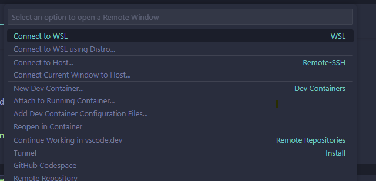
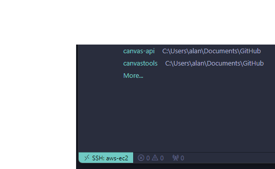

#### Section Overview

This guide will show you how to set up the IDE VS code to code & connect to our VM's.

#### Prerequisites

- **VS Code**: If you haven't already download & install on your local: [https://code.visualstudio.com/download](https://code.visualstudio.com/download)
- **Git**: If you haven't already download & install on your local: [https://git-scm.com/downloads](https://git-scm.com/downloads)
- **AWS CLI**: If you haven't already download & install on your local: [https://docs.aws.amazon.com/cli/latest/userguide/install-cliv2.html](https://docs.aws.amazon.com/cli/latest/userguide/install-cliv2.html)
- **AWS SSM Plugin**: If you haven't already download & install on your local: [https://docs.aws.amazon.com/systems-manager/latest/userguide/session-manager-working-with-install-plugin.html](https://docs.aws.amazon.com/systems-manager/latest/userguide/session-manager-working-with-install-plugin.html)

#### How-To Guide

1. Open Vs Code, go to the extensions menu on the left hand sidebar search & install plugin -> Remote SSH.

2. On the bottom lefthand corner, press the remote connection button (Looks like `><`)

3. Select 'Connect to Host'

4. Create your ssh config file. Click Add new SSH Host

5. On your instance, go to your instance details and press connect to instance. Use these details to fill out your host config file. Note that you are using the Public DNS as your HostName. 

~~~~
Host aws-e2
    HostName <your-ec2-ip-address>
    User ec2-user
    IdentityFile ~/.ssh/labsuser.pem
~~~~

1. On the bottom lefthand corner, press the remote connection button (Looks like `><`). Now Connect to host to your new SSH host.

7. This will open up a new VS code window. You will be prompted for the OS - select Linux. Then accept the fingerprint.

8. You are now ready to use your EC2 remotely!

<!-- 1. Open visual VS code, go to the extensions menu on the left hand sidebar search & install plugin -> aws toolkit.

1. Open the Command Palette (`Ctrl+Shift+P`) and type `AWS: Create Credentials Profile` and press enter. Copy the default json & create a new profile using your credentials from the excel you downloaded on creation of your IAM user profile.

3. In the bottom right hand corner click on the AWS:profile button. Select from the menu the profile you just created >Select terminal > Start new terminal session. By default it will open a CMD. In the terminal of your choice, Enter `aws ssm start-session --target <your instance Id>` -->

#### Common Errors
- **Access Denied Exception**: If you alt tab away when selecting the OS / Accepting thumbprint, the remote connection will fail.

- **Access Denied Exception**: If you get this error it is most likely that the tag you entered during build of the VM does not match your IAM user profile name. Create a new instance ensuring the qut-username tag is identical to your IAM user profile name.  As a cleanup exercise please post Teams 'please delete my faulty VM instance id is xxxxxxxxx'.

