[toc]

## Module 2 Practical Introduction

#### Getting Started with Docker

> Docker is an open platform for developing, shipping, and running applications. Docker enables you to separate your applications from your infrastructure so you can deliver software quickly. With Docker, you can manage your infrastructure in the same ways you manage your applications. By taking advantage of Docker’s methodologies for shipping, testing, and deploying code quickly, you can significantly reduce the delay between writing code and running it in production.
> 
> Docker is lightweight and fast. It provides a viable, cost-effective alternative to hypervisor-based virtual machines, so you can use more of your server capacity to achieve your business goals. Docker is perfect for high density environments and for small and medium deployments where you need to do more with fewer resources.
> 
> Source: [Docker Documentation](https://docs.docker.com/get-started/overview/)

*Please continue reading the Docker overview page in the official documentation, [here](https://docs.docker.com/get-started/overview).*

Docker is available in two guises:

1. For enterprise customers (paid)

2. For customers in the community (free; we will use this one)

In this practical, we will work with Docker under Linux. Specifically, in an EC2 instance as created in practical 1. You may also run Docker on Windows or Mac OS. Please note, if you are using an older version Windows, Docker may not be compatible. Please see the instructions and links in the appendix for details of these alternatives. Unfortunately, we cannot directly support every operating system. This practical assumes that your virtual machine is running a recent version of Ubuntu. 

Note about Assignment 1: you will need to use Docker in a specific Linux VM. We will provide more information at appropriate times.

Note: Some screenshots may have minor inconsistencies due to command updates (Python 3) and recent EC2 updates from AWS. If you have any problems, please do not hesitate to contact the teaching team or consult your peers.

The basics of using Docker are covered very nicely in Docker’s own tutorials.  The full tutorial will take about 30 minutes if things go according to plan.

#### Prerequisites and References

In this unit, we will work mainly with the Linux version of Docker, and the supported version will be **Ubuntu LTS 22.04**. It is a requirement of this prac exercise, and assignment 1, that you are able to deploy your Docker container to the public cloud. At some point, you will need to launch a VM on AWS. Preparation of the Docker image can take place anywhere you can access a tame Linux workstation. 

- Access to a Linux system:
  - **This approach is used in this practical:** 
    - Use one Linux VM to prepare the image 
    - Use another VM for deployment of the container after we have pushed it to Docker Hub.
  - Using personal Linux machines (i.e., Linux installed as the host operating system)
  - Docker under Windows Subsystem for Linux
    - [Visual Studio documentation](https://code.visualstudio.com/blogs/2020/03/02/docker-in-wsl2) 
    - Note: this doesn’t work well on the QUT lab machines
  - Using Virtual Box [https://www.virtualbox.org/](https://www.virtualbox.org/) 
    - Install Linux as a guest operating system
    - or an alternative VM manager
- Installation of Docker: this is essentially the same as the approach in Guide to working with the QUT managed AWS machines, though you can use the apt-get mechanism if you prefer
- Creating an account on Docker Hub:
  - Similar to GitHub for storage of your Docker images; once they are pushed to Docker Hub they can be installed and run anywhere e.g. in a cloud server instance. 
  - This is now wrapped into the Docker Cloud but the Hub is still the service we require.
- [Docker reference](https://docs.docker.com/)
- Docker Getting started guide: [https://docs.docker.com/get-started/ ](https://docs.docker.com/get-started/). 
  - This is particularly good on the terminology and concepts. 
    - For example, you should be familiar with the distinction between the container and the image. 
  - In various places, the guide mentions Docker services for the cloud platforms AWS and Azure. 
    - Please **do not** use these. 
    - They are set up for orchestrated deployment at scale, integrated with the cloud services. 
    - They are important but they are not suitable as a starting point. Let’s understand the basics first. 

#### Week 2 Practical Files

- <filelink filename='DockerPrac.zip'>DockerPrac.zip</filelink>

----------------------------------------------------- 

## Exercise 1: Installing and using Docker

We will follow the installation process for Docker as provided in the AWS Guide. As noted earlier, there may be some differences between the screenshots below and what you will see in the QUT environment. 

Docker is fundamentally a system built for use under Linux, and you should experience few problems installing under a native Linux environment. The relevant section from the AWS Guide is included below. This should also work seamlessly from local installations of Ubuntu. 

We will begin by installing Docker, and running a basic sanity check deployment of "hello-world". Docker exists at: https://www.docker.com/. To install new software, we would normally use the `apt-get` application, but here there are more convenient alternatives.

If you haven't already, boot up an Linux VM (or connect to the AWS EC2 instance you created in Week 1).

In this guide, we will be using VSCode to connect to the VM. You may see images of older screenshots being used, but the steps are the same.

#### Step 1: Run Command to install docker.

```
sudo curl -fsSL https://get.docker.com/ | sh
```

By default, your machine should have curl installed. Use `sudo` to ensure that the installation scripts have elevated privileges. Once the Docker installation is complete, you should run a basic Docker hello world to confirm that everything is running as expected. 

During the installation process, you may be offered the chance to add a username to the Docker group. If you are able to do this, make the adjustment for your chosen username. If you did not do this, then you will need to run the Docker commands below prefixed by `sudo`. If you encounter the error that Docker cannot connect to the Docker daemon, this is almost certainly the issue, and the use of `sudo` (though not exactly ideal practice) will allow you to proceed.

For my instance, I had to run the following command to ensure docker plays nicely:

```
# Some additional setup - to make it run nicely without sudo! 
sudo sh -eux <<EOF
# Install newuidmap & newgidmap binaries
apt-get install -y uidmap
EOF

dockerd-rootless-setuptool.sh install
```

After successful installation of Docker, you should see something like this:

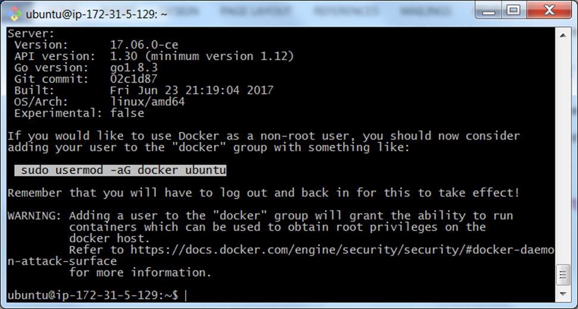

#### Step 2: Test run `hello-world` example.

Let's run the code below. This should run without issue. Try running the `hello-world` example without using `sudo`:

```
docker run hello-world 
```

You should see something like this, with an additional message if the image was not available locally and had to be pulled down from the web. 

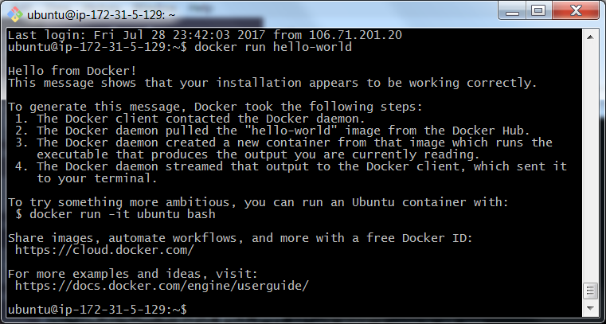

#### Step 3: Download Ubuntu image and whalesay.

We will be using this local copy to work on. We don’t initially have a local copy and so it grabs the image from a remote store at the Docker Hub.

```
docker run -it ubuntu bash
```

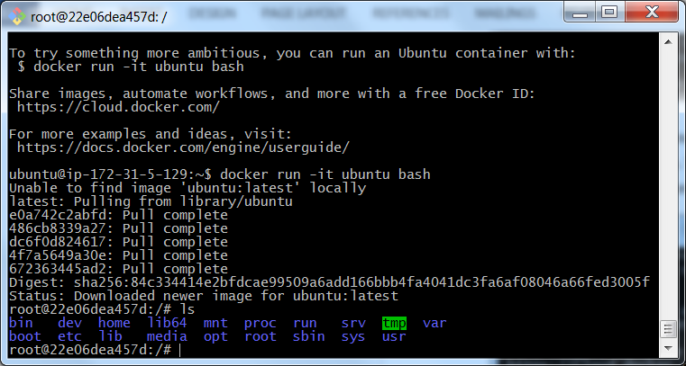

Note: the username and hostname of the prompt have changed from `ubuntu@ip` to the `root@22e...`, as shown at the bottom of the screen. We are now in the command interface of Ubuntu within the Docker container, which is sitting on top of Ubuntu on the AWS VM. 

You can press `ctrl+c` (for Windows) to exist the container.

Now, let's continue through the tutorial and use the Whalesay image.

We begin by working with the vanilla Whalesay image. The application is trivial, and is an adaptation of an earlier unix sayings app called cowsay. The details of Whalesay can be found at: 

- [https://hub.docker.com/r/docker/whalesay/Links](https://hub.docker.com/r/docker/whalesay/Links)

Let's run the following command to run whalesay / download if not already.

```
docker run docker/whalesay cowsay boo
```

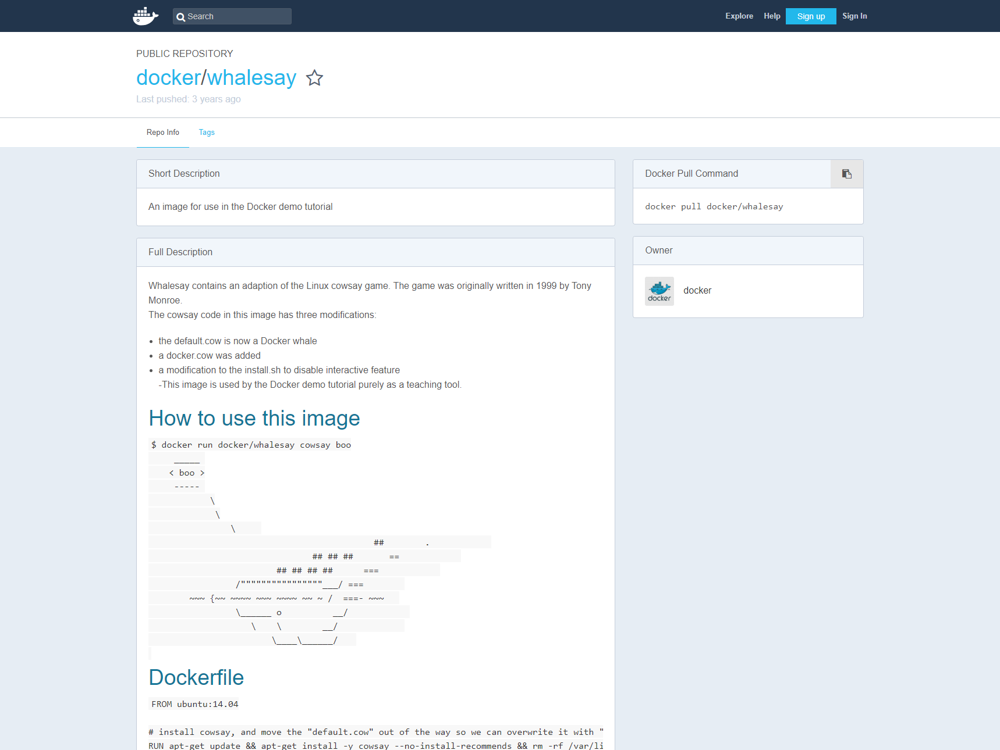

Don’t take it seriously. Execute the command and we see the screenshot below it:

```
docker run docker/whalesay cowsay boo
```

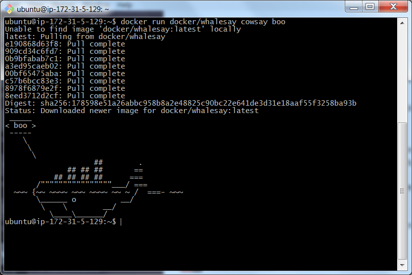

Note: the content of the whale may change per run.

We are now going to create a simple Dockerfile following the conventions introduced in the lecture. 

```
# Create a folder to do some builds...
mkdir mydockerbuild #(create a directory named mydockerbuild)
cd mydockerbuild #(go to directory created above)
```

Usually, you would want to make sure that the system is up-to-date, but since we only just obtained the application, no commands to obtain updates are needed. Note that this will be a common theme in Docker related exercises. We will use this guide to create the Dockerfile and then using Docker to transform this into an image are found here (you may have to scroll up a few lines):

Please read this article: https://medium.com/@deepakshakya/beginners-guide-to-use-docker-build-run-push-and-pull-4a132c094d75#6562

Let's create our first Dockerfile. A `Dockerfile` is a text document that contains all the commands a user could call on the command line to assemble an image. 

On VSCode, we can simply create a new file, name it `Dockerfile`, then save it into the working directory we are in (namely `mydockerbuild`).

Inside the Dockerfile, put in the following:

```
FROM docker/whalesay:latest
RUN apt-get -y update && apt-get install -y fortunes
CMD /usr/games/fortune -a | cowsay
```

In general, you will need to build your image with `docker build -t docker-whale .` . (here we have tagged our image `“docker-whale”` - also note the `.` at the end - we need this! ).

My session is shown below. The output is dominated by the update, some of which I have not shown. Pay particular attention to the steps corresponding to the commands in the Dockerfile, and the intermediate hashes that appear at each stage. This means that if there is an error later on, we don’t have to rebuild everything from scratch when we start again.

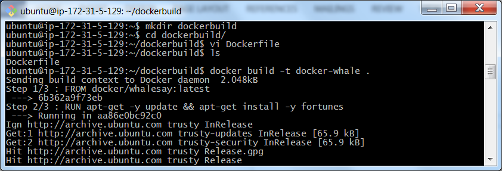
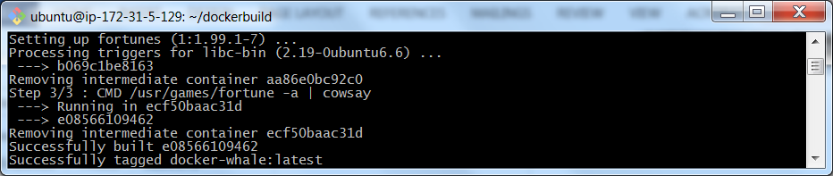

At this point, we can run the new image that we just tagged. This time, we got a very long quote from Linus Torvalds:

```
docker run docker-whale
```

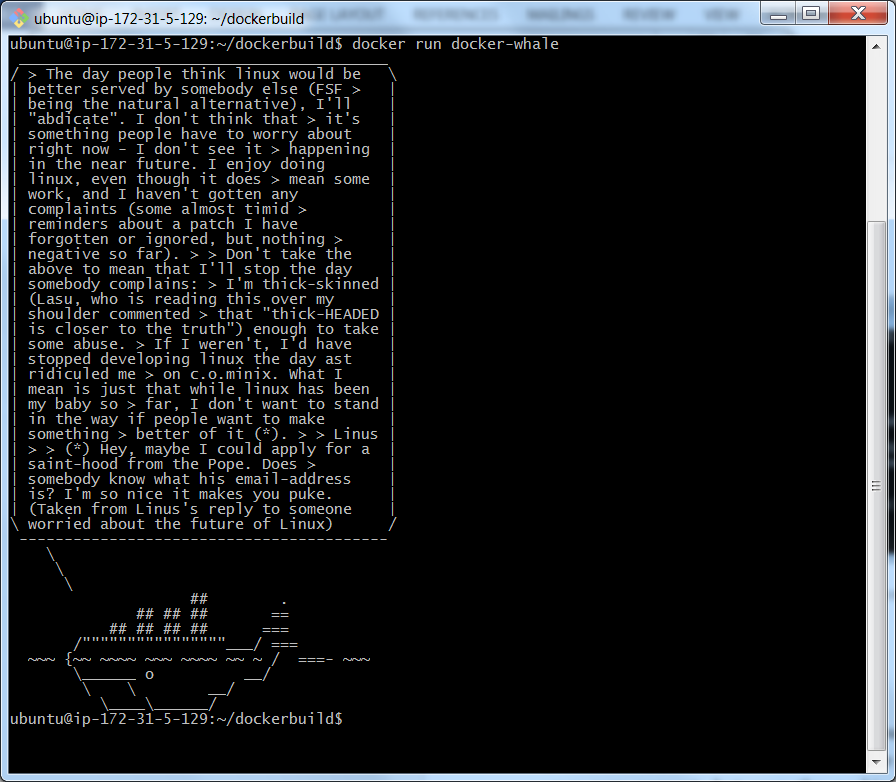

Finally, the linked tutorial tells you to create your own Docker Hub account and to push your own copy of this new version of the whalesay app. Please create your own account, along with a new repository.

We will be using this guide to help: https://medium.com/@deepakshakya/beginners-guide-to-use-docker-build-run-push-and-pull-4a132c094d75#44f4

After you created your public repository, let's tag our image with the following convention:

```
docker tag <image-id of docker-whale> <your dockerhub username>/docker-whale:latest
```

The next step is to authenticate and login to DockerHub. The docker login command will prompt you for your username and password. You should supply your DockerHub credentials. When entering your password, you won't see any characters in the terminal - this is an intentional security measure. Once successfully authenticated, Docker automatically stores an authentication token on your system that allows you to interact with the registry.

```
docker login
```

Then we can upload (think of git push) to docker:

```
docker push <image-name>
```

Before moving on to the more complex matters, it will probably help to explore some of the more useful Docker commands and perhaps to clean up a little. There is a reason for this, as we will see shortly. 

Docker follows very standard Linux command line conventions:

```
docker --help
```

This generates a substantial list of commands and alternatives. We will focus on those that manage the images and the containers. To follow through on these exercises, login to the same VM using a second terminal window, or create another xterm if you are using the machine locally. This will allow us to monitor the machine when we have a running Docker container. At present we have no containers running (`docker ps`) but by using `docker ps –a`, we can see all of the containers that I have used over the course of the session:

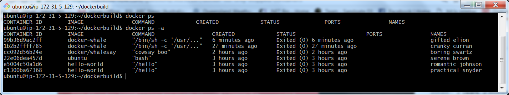

Note the new equivalent version of this command: `docker container ls`

Take note of the hash IDs for some of these containers. In a moment I am going to look at some images, and try to delete the one for docker/whalesay. Here of course we see that this image is associated with the exited container boring_swartz (container names are obviously enough, auto-generated), which has ID cc092d56b24e. Let us now list the images.

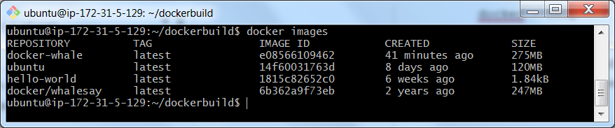

I don’t really care at all about the whalesay image and so I am going to destroy it. The `docker rm` command removes containers; here I want to remove images, and the command is similar, `docker rmi`. We can force delete via `-f` switch.

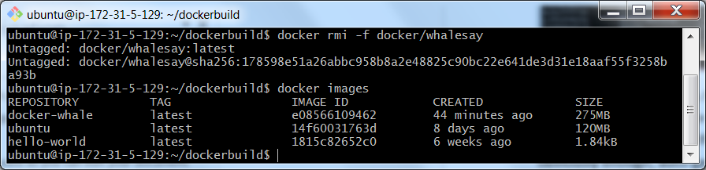

We now look at docker-whale, and run it again using the usual command:

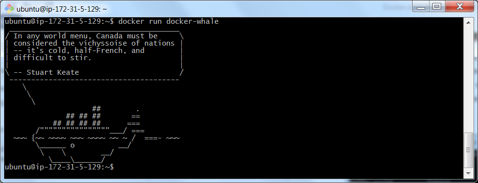

We see that it works just fine – the fact that docker-whale builds on the earlier docker/whalesay image is not an issue. The new Docker image is independent of the earlier one. We now run the Ubuntu image and monitor it from the other login terminal. Here the bare `docker ps` command shows a running container.

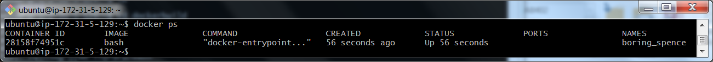

An attempt to remove the container meets with some issues:

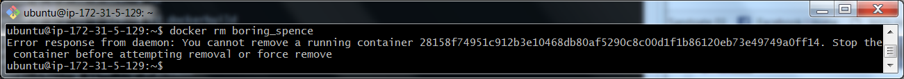

As before, we can force, but we will choose not to. If we want to, we can remove the others. Here I remove practical_snyder using the tag name, and romantic_johnson using a unique prefix of the hash ID:

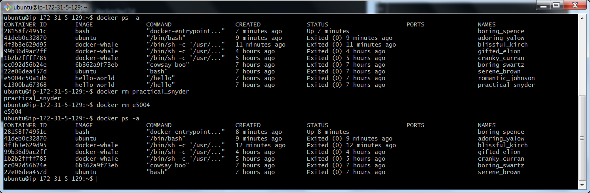
I then proceeded to clobber all of the containers other than the one presently running. Following on from this, we can revisit the idea of deleting an image. I don’t want even the modified docker-whale image, and so, this one is my main target:

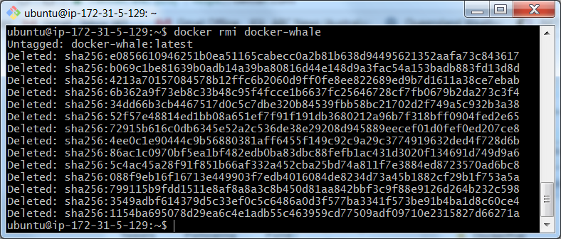

Note that killing an image will also remove the hashes corresponding to the states encountered in its creation. At this point, we still have a nice running Ubuntu server with Docker installed and an Ubuntu image available. Over the coming week or two we may find ourselves wanting to reuse configurations. Sometimes this is best done at the Docker container level, sometimes at the level of the VM itself. Here we will learn how to preserve a VM.

----------------------------------------------------- 

## Exercise 2: Preserving Docker / VM Images

If you completed Exercise 1 using AWS VM, then you will be able to see the results of the Image creation/Launching of new EC2 instance. If not, feel free to modify your AWS EC2 so you can see the results of this exercise.

#### Step 1: Create AMI Image

Go to the EC2 instance view and use the right click menu on your instance, selecting Image > Create Image
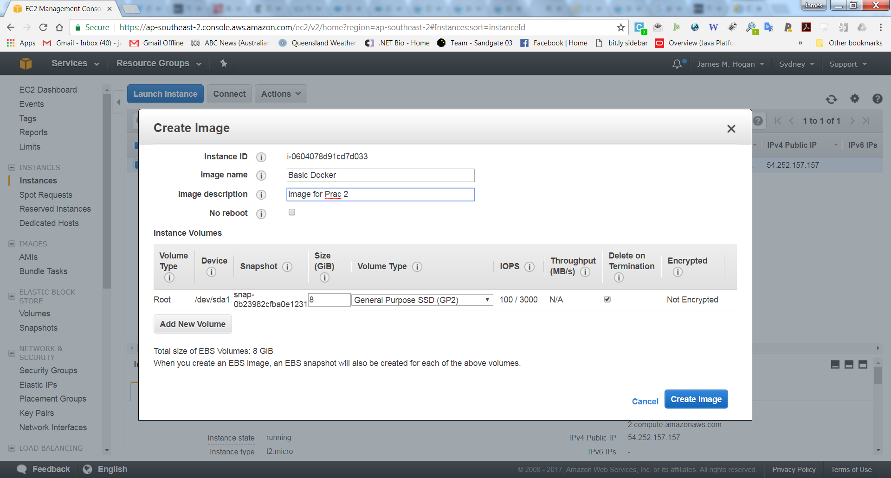

#### Step 2: Creating Storage

Once the image is created, we go to the menus on the left hand side and select AMIs under the Images heading. In my case we see two images, one saved from last year. The cost of storing these images is very low but please try to reduce your unnecessary spending: [https://aws.amazon.com/ebs/pricing/Links](https://aws.amazon.com/ebs/pricing/Links).

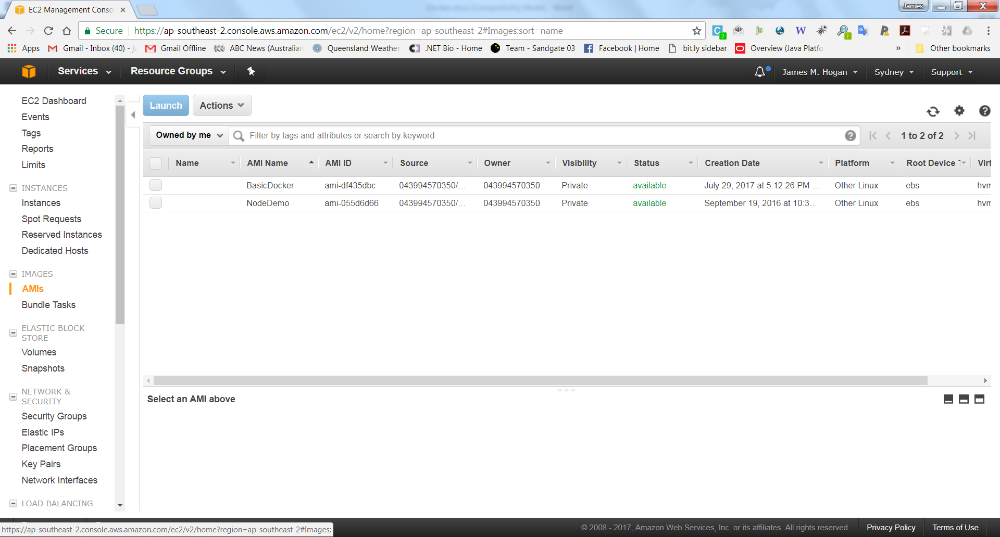

Suppose now we want to resurrect this image and use it for later work. In my case, I finished this section earlier this afternoon and have now come home again, and so I can fire up the server. The key in using such a machine – and keeping costs down while doing so – is to not maintain the active storage and to not preserve the IP address. We treat it just like another machine image like those in the menus, with IP and other settings to be added during launch.

#### Step 3: Restoring the Image

At this stage, we select the image and enable the launch button. We click to follow pretty much the standard process. Make sure that you have a suitable custom TCP rule in place in the security settings to allow http access to the machine. Here you should open port 8000. You will need this to verify that the exercises are completed correctly. See the port mapping later in the prac.

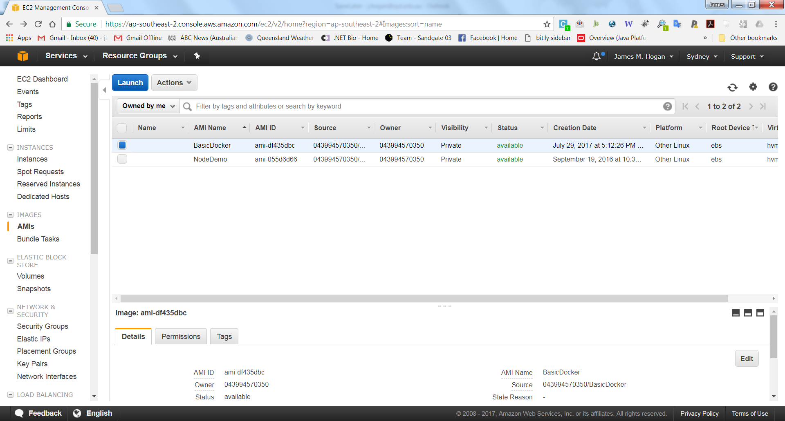

After launching and following the usual login procedure – note that AWS may use root as the default username in the connect example and you will have to change to ubuntu – we find the image as expected. Here I have changed into the dockerbuild directory and run the docker images command to show that the earlier images are preserved:

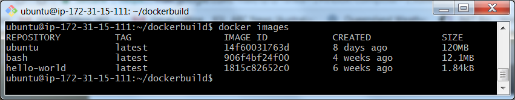

We are now ready to start work on the more sophisticated exercises which make up the rest of this prac. Once again we will build using Dockerfiles rather than using docker compose. Both approaches have their merits, but for now I think that the direct use of the Dockerfile is a better teaching approach. We will now build a Python server – this will be much more sophisticated than the very simple approach you took in the first prac. But it is still well short of a real web server usable in a production environment.

----------------------------------------------------- 

## Exercise 3: Ubuntu with Python Server (Hello World)

In this exercise you will build a Docker image based on:

- Ubuntu Linux, 
- install Python, 
- and create a simple Hello World Python app which gets served by a Python Web Server Gateway Interface (WSGI). 

You will be able to view the output in a browser by navigating to the IP address of the underlying Docker machine. You can use [https://docs.docker.com/develop/develop-images/dockerfile_best-practices/](https://docs.docker.com/develop/develop-images/dockerfile_best-practices/) for Docker conventions and best practices. In particular, this provides really good background on the use of apt-get and the structures to use to avoid caching issues and Dockerfile creation failures. I strongly recommend that you follow the recommended conventions with respect to the lexically ordered, one app per line construction of the apt-get arguments.

#### Step 1: Start your image

Fire up the AMI you saved in the previous exercise or use your local Linux machine or VM. (We'd use the AWS VM for this exercise)

#### Step 2: Open Docker terminal prompt

Return to the Docker terminal command prompt.

#### Step 3: Get the list of docker images

Type docker images at the command prompt to view your current list of images.

#### Step 4: CD to your Docker work area

Navigate to your Docker work area and create a directory named exercise3. This directory will contain the Dockerfile which creates the image and the necessary files to run the Python application.

```
exercise3
|- DockerFile
```

#### Step 5: Create directory structure

The following directory structure is required. It will sit alongside Dockerfile.

```
exercise3
|- DockerFile
|- app
||- app.py
||- server.py
```

#### Step 6: Download required files

app.py and server.py have been provided in the zip available at the top of this page (DockerPrac.zip). Copy them into the exercise3/app directory. (Quick tip - can probably get away just c/p via vscode)

#### Step 7: Create Dockerfile

Here we will be updating the Dockerfile in the exercise3 directory.

__a:__ We are building an Ubuntu image. The FROM command is used for this

```
############################################################

# Dockerfile to build Python WSGI Application Containers

# Based on Ubuntu – by default here the latest version

############################################################

# Set the base image to Ubuntu

FROM ubuntu
```

__b:__ The file author should be included as with all software. the LABEL command is used for this (MAINTAINER Command is old and deprecated).

```
LABEL authors="yu39"
```

__c:__ We continue to author our `DockerFile`. Following the guidelines in the best practices doc, we now create an extensive apt-get task which performs an update to Ubuntu and grabs specific applications, with each of these laid out in alphabetical order to allow easy updates and maintenance. Pip is a package manager for Python. We get it to install the modules needed for this exercise. Please note that there are differences between Ubuntu 18.04 and later versions such as 22.04. The code below has been tested under AWS and WSL for 22.04 (ubuntu latest) but please speak to a tutor if you encounter any difficulties.

```
# Install basic applications, Python, Python tools RUN 

RUN apt-get update && apt-get install -y \
build-essential \
curl \
dialog \
git \
net-tools \
python3 \
python3-dev \
python3-setuptools \
python-distribute \
python3-pip \
tar \
wget

# Get pip3 to download and install Python requirements:

RUN pip3 install flask
RUN pip3 install cherrypy
```

__d:__ The next commands copy the application folder to make it visible to the server, open access to port 80 for Web access and set the default directory in which the application will execute.

```
# Copy the application folder inside the container

ADD /app /app

# Expose ports

EXPOSE 80

# Set the default directory where CMD will execute

WORKDIR /app
```

__e:__ Finally the CMD command is used as the entry point for the application and it starts the server

```
# Set the default command to execute when creating a new container

# i.e. using CherryPy to serve the application

CMD python3 server.py
```

#### Step 8: Build image

Build the Docker image. It will be tagged and referenced as pythonwsgi. This command looks for Dockerfile in the current directory i.e. ‘.’ and builds the image according to the script which was just generated. 

```
docker build -t pythonwsgi .
```

This may take a while – both the update process and the possible interruptions from network timeouts. Just keep executing this command until eventually you get a message that you have completed successfully. The RUN apt-get command is the most troublesome. Docker will create an intermediate container for each of the commands successfully executed and preserve these until the build is completed. The process will skip over completed steps and re-commence at the start of the next task, even if we have attempted it before.

A reminder too that this screenshot is from an earlier version of the Dockerfile and there may be minor differences in what you see – these are due solely to the changes to the Python packages on the system.

The screenshot on the next page shows the output I received after the final execution of the command. On this occasion I did not need to try multiple times, though this is no guarantee. As we saw earlier, the individual stages of the process and their associated checksums are your friend here – they can save you a lot of grief.

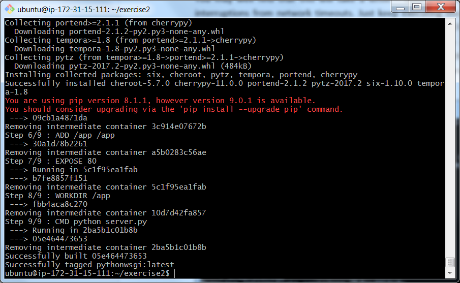

You can ignore the message about the pip command here. We have moved on to another version in any case.

We can confirm there is our newly created docker image via `docker images`

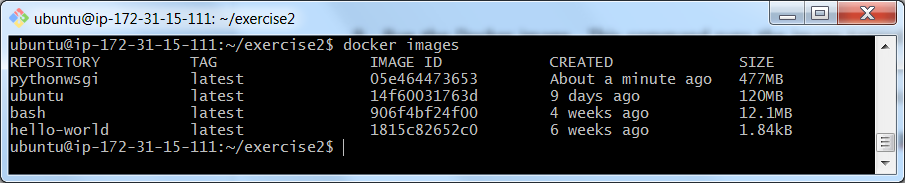

#### Step 9: Run Docker Image

This command runs the image tagged pythonwsgi in a Docker container which we name exercise3, and sets the correct port for external communications. The command line will wait until you press Ctrl + C to stop the application.

```
docker run --name exercise3 –p 8000:80 –i –t pythonwsgi
```

Here we are using the `–p` flag, which maps the machine and container ports:

`-p local-machine-port:docker-container-port`

Here we are mapping port 80 of the Docker container (the default for http) to port 8000 on the VM server. If we want to let this application run and continue working at the command line we can add the `–d` flag to daemonise the application:

`docker run --name exercise3 –p 8000:80 –i –d –t pythonwsgi`
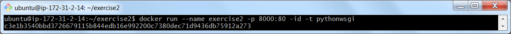

The daemonised version will return a hash as shown.

#### Step 10: Check Container

To confirm that the application is in place and serving pages correctly, you should open a web browser and navigate to the VM IP address. Note that the machine name may tell you the IP address, but if this is from an earlier AMI (as in this case), the approach isn’t reliable. So instead, check properly in the EC2 dashboard as shown. You could also use the full domain name from the connection information.


In my case, I open a browser at: `http://54.252.139.70:8000/`. and see Hello World! as expected. Note that this is NOT port 80 as we have on the container. Port mapping works.

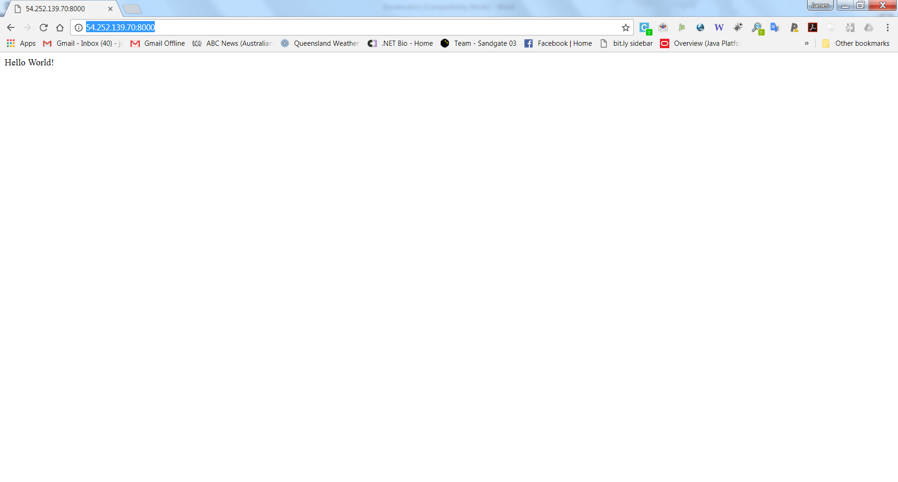

You can use `docker rm exercise3` if you want to remove the container. This will not remove the image, which you can see with `docker images`.

----------------------------------------------------- 

## Exercise 4: Ubuntu with Python Server (Word Count)

In this exercise you will:

- build on the Docker image created in Exercise 3, 
- install some extra Python libraries, 
- and alter the Python app from Exercise 3 to download data from the Natural Language Toolkit (NLTK) data store, 
- create a frequency distribution of the words in the data and display the most frequent words in HTML so that each word has a size and colour based on its relative frequency. 
- you will be able to view the output in a browser by navigating to the IP address of the Docker machine.

NLTK is a Python library and relies on the installation of the scipy and numpy packages. An NLTK Cheatsheet with Python code for some common tasks exists at [http://bet.andr.io/code/nltk/cheatsheet/](http://bet.andr.io/code/nltk/cheatsheet/)

#### Step 1: Configure work area

Navigate to your work area and create a new directory named exercise4. Copy the contents of the exercise3 directory into the new directory.

#### Step 2. Edit Dockerfile.

The following libraries need to be installed using apt-get python3-numpy and python3-scipy. The NLTK library (nltk) has to be installed using pip3 with a –U flag.

#### Step 3: Update app.py

The major changes will occur in the app.py file.

__a:__ The following imports and downloads are required.

```
import nltk

from nltk import FreqDist

nltk.download('gutenberg')

from nltk.corpus import gutenberg
```

Project Gutenberg is a collection of books and part of the NLTK data collection.

__b:__ We will now create a method named `count_words()` which will replace `hello()`. The method will load a book from Project Gutenberg, create a frequency distribution, extract the most common 500 (or some other number) tokens (tokens include punctuation and duplicate words with different case) and generate HTML to display the most common words in different font sizes and colours depending on the word’s relative frequency to the maximum frequency.

__c:__ We first load the tokens from Sense and Sensibility, and then create a list of lower case words if they are not punctuation.

```
tokens = gutenberg.words('austen-sense.txt')
tokens = [word.lower() for word in tokens if word.isalpha()]
```

__d:__ Create a frequency distribution using the extracted tokens. From the frequency distribution extract the most common 500 words.

```
fdist = FreqDist(tokens)
common = fdist.most_common(500)
```

__e:__ The most common word data structure is a sequence with each entry being a tuple of the word and its frequency. To be able to create the word output we need to extract the words from the dictionary into a list and sort them.

```
words = []

for word, frequency in common:
  words.append(word)

words.sort()
```

__f:__ We need to get the frequency of the most common word for formatting the font size and colour of the HTML output.

```
highCount = common[0][1]
```

__g:__ Now that we have an alphabetically sorted list of the most common words we can start to build the HTML output. Declare a string variable named html and assign to it an opening html tag followed by a head with title, followed by an opening body tag. An h1 heading can be added as well.

```
Exercise left for the reader to complete. Check the appendices for a sample solution :D 
```

__h:__ `For each` word in words we can now calculate a size in pixels to display and calculate a hexadecimal colour. The hex function converts an integer to hexadeximal but the result has 0x before the hexadecimal digits. They need to be removed and the hex needs to be padded with leading 0s to a length of 6.

```
for word in words:
  size = str(int(15 + fdist[word] / float(highCount) * 150))
  colour = str(hex(int(0.8 * fdist[word] / \
  float(highCount) * 256**3)))
  colour = colour[-(len(colour) - 2):]
  while len(colour) < 6:
      colour = "0" + colour
```

__i:__ Each word can be added to a HTML span. Each span can be given CSS style for font-size in px and color which must be preceded by a #. An example span element is given below. Follow each span element with a space character so the HTML breaks across the page.

```
<span style="font-size: 16px; color: #017e22">comfortable</span>
```

__j:__ After the for loop is completed we can add the closing body and html tags to the html variable and return it.

```
Exercise left for the reader to complete. Check the appendices for a sample solution :D 
```

#### Step 4: Build Docker Image

Build the Docker image wordcount using the same commands as before. After rather a long time, you will see something like the following:

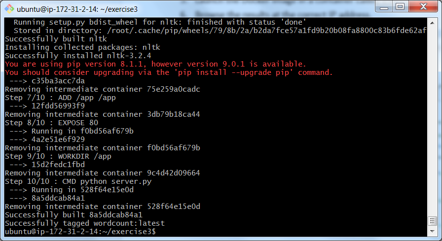

#### Step 5: Launch Docker image

Launch the Docker image (again modifying the commands you have seen above) in a container called exercise4.Browse the results at the correct IP address, and once again at port 8000, unless you have changed the security settings for the instance (this may not apply for local Linux machines and will depend on your security settings).

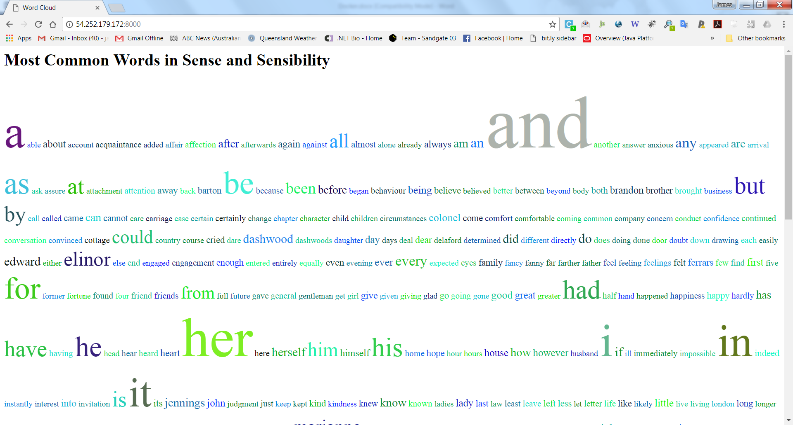

----------------------------------------------------- 

## Exercise 5: Word Count Without Stop Words

In this exercise you will:

- build on the Docker image created in Exercise 4 by removing the Stop Words from the word list and displaying everything else. 

Just keep the same directory structure – we are just modifying app.py to make it more realistic. Stop Words in natural language processing are the most common words in a language. For English that includes: verbs like is, are, be etc.; articles like a, an and the; pronouns like he, she, they etc.; prepositions like on, in, at etc.; and others. The NLTK has a list of stop words that can be imported.

Simple guidance on using the stop word lists in NLTK may be found on the web at [https://pythonspot.com/en/nltk-stop-words/](https://pythonspot.com/en/nltk-stop-words/). We steal the same ideas and apply them to the Jane Austen word list.

#### Step 1: Import stop words

We first import the stop words – put these below the other imports

```
nltk.download('stopwords')
from nltk.corpus import stopwords
```

#### Step 2: Create stopwords

We then create a set of English stopwords – put this under the function definition

```
# Define the stopword set
stopWords = set(stopwords.words('english'))
```

#### Step 3: Config filtering

We then add an additional filtering line in the processing of Sense and Sensibility

```
# Grab Sense and Sensibility; tokenize; filter stop words;
# get frequency distribution
tokens = gutenberg.words('austen-sense.txt')
tokens = [word.lower() for word in tokens if word.isalpha()]
tokens = [word for word in tokens if word not in stopWords]
fdist = FreqDist(tokens)
```

After rebuilding the Docker image (perhaps you can call it filteredwordcount) we can run it in a container called exercise5. With the usual conventions we will see something like the image on the next page. It is a somewhat better reflection of the style of the writer.

#### Step 5: Push to Dockerhub

Finalising – pushing to Docker Hub and pulling to another machine

Earlier, following the tutorial from Docker, you created your own Docker Hub account. Using the Docker images command (and cleaning a few unwanted images), we have something like:

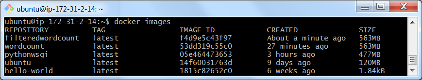
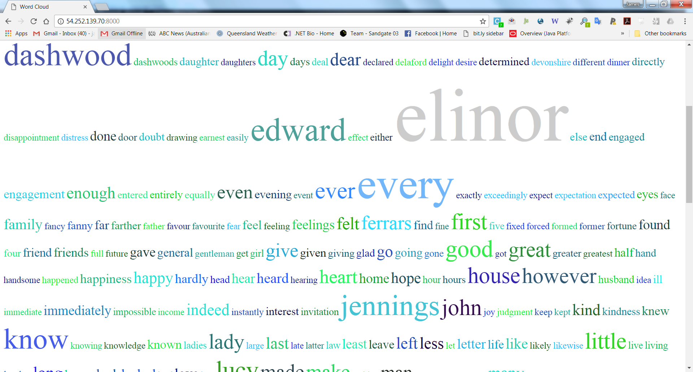

I have long ago uploaded the images for exercises 3 and 4. I will now upload the most recent filteredwordcount image to Docker Hub. I will begin by associating it with my account. This is handled by the tagging command, which may cover a rename as well. In my case, the command has the form (note the abbreviated ID):

```
docker tag f4d9e jamesmhogan/filteredwordcount:latest
```

As before, we see the list of images available, with dual entries reflecting the multiple tags.

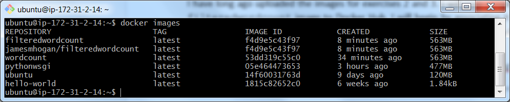

We follow the tutorial and upload our images. Currently, my dashboard on Docker Hub looks like this, showing the two public repos for exercises 3 and 4 above.

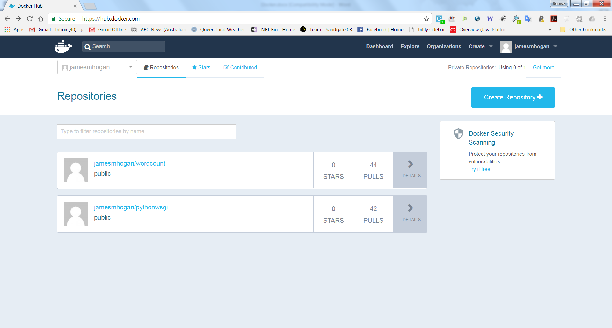

After clicking on the blue Create Repository button at top right, we have the following. I have added the appropriate repo name and a basic description. We now click on Create.

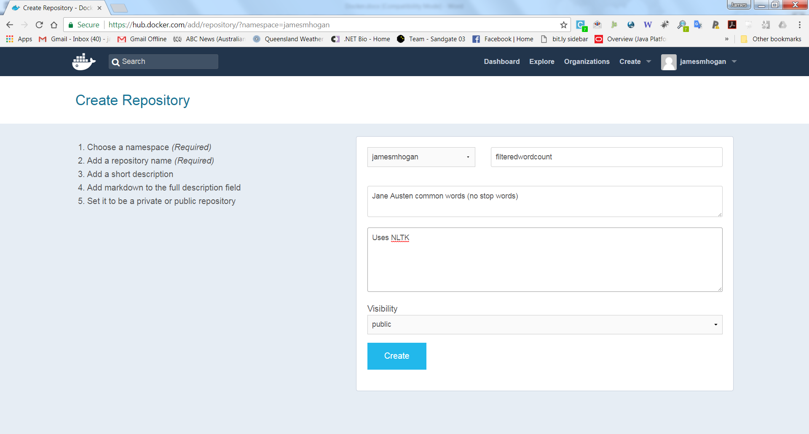

The image below shows a docker login and then a successful push to Docker Hub.

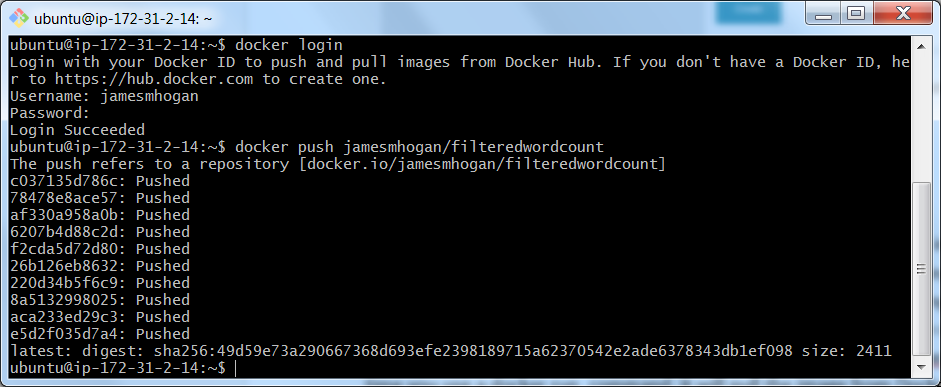

And here we see the revised version of the dashboard view:

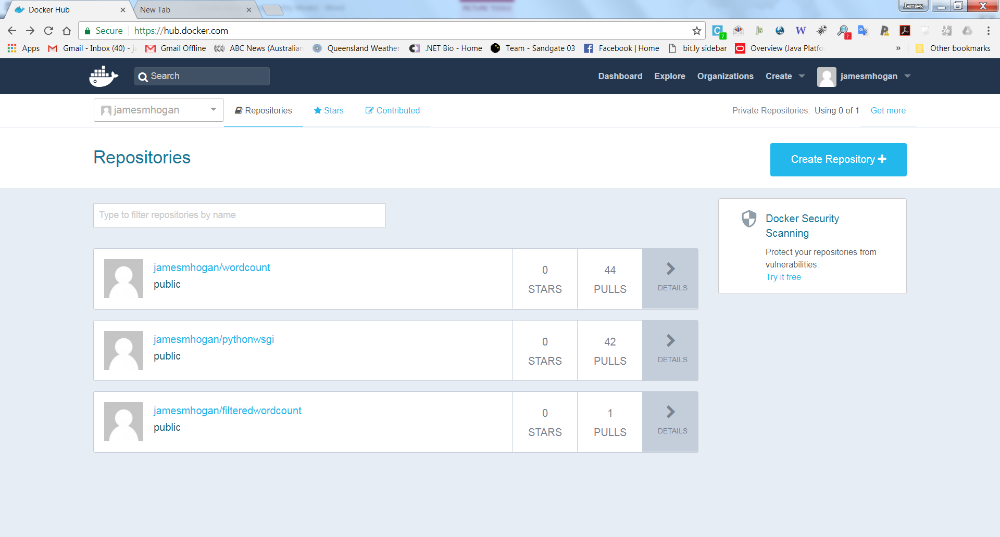

Now, as a final test of everything, fire up a second instance of the basic AMI which we started with. Even those people who have been working on a local Linux machine should do this. The configuration should have a basic Ubuntu LTS 22.04 or later and a current installation of Docker. Your goal is to pull down the latest of your images and run the application that we have just created. After all, this sort of deployment is what Docker is all about. As before, expose a port other than the standard http port 80. In my case, I will again use 8000. We will again map the container port 80 to the server port 8000. At present, I am starting with just two basic images:

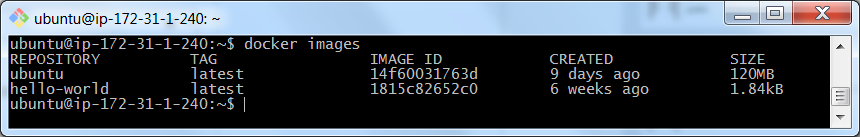

We go ahead and run the image:

```
docker run --name exercise4 –p 8000:80 –i –d –t jamesmhogan/filteredwordcount
```

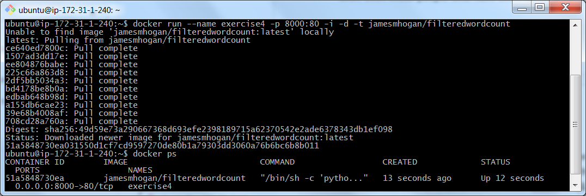

And once again we see the filtered version of the wordcount in the browser:

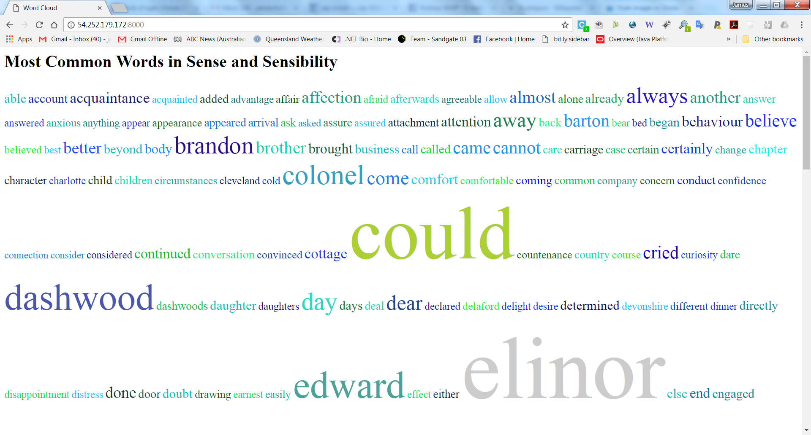

That concludes the exercise. Make sure you have a local copy of the python files you have created, and/or create an updated AMI and preserve the machine state. Then go ahead and TERMINATE ALL EC2 INSTANCES as you have previously been instructed to do. As before, do NOT just STOP them. You must ensure that instances are terminated if you wish to avoid charges.

----------------------------------------------------- 

## Appendices

#### Completed word cloud script

```
from flask import Flask

import nltk
from nltk import FreqDist

nltk.download('gutenberg')
from nltk.corpus import gutenberg

# nltk.download('stopwords')
# from nltk.corpus import stopwords

app = Flask(__name__)

@app.route("/")
def count_words():
    tokens = gutenberg.words('austen-sense.txt')
    tokens = [word.lower() for word in tokens if word.isalpha()]
    # tokens = [word for word in tokens if word not in stopWords]
    fdist = FreqDist(tokens)
    common = fdist.most_common(500)

    words = []
    for word, frequency in common:
        words.append(word)
    words.sort()

    highCount = common[0][1]

    html = "<html><head><title>Word Cloud</title></head><body><h1>Word Cloud</h1>" ;

    for word in words:
        size = str(int(15 + fdist[word] / float(highCount) * 150))
        colour = str(hex(int(0.8 * fdist[word] / \
                             float(highCount) * 256**3)))
        colour = colour[-(len(colour) - 2):]
        while len(colour) < 6:
            colour = "0" + colour
        temp = "<div style=\"display: inline-block\"><span style=\"font-size: " + size + "px; color: #" + colour + "\">" + word + "</span></div>";
        html += temp;
    html +="</body></html>";
    return html

if __name__ == "__main__":
    app.run()
```

#### Further Details: Docker at home

If you want to run Docker on your home machine running Windows or Mac OS then you should first download the installer at: [https://www.docker.com/products/docker-desktop](https://www.docker.com/products/docker-desktop)

The site will detect your OS and select the right version. 

You then need to learn a bit more about Docker on your system. The Docker documentation has a number of sections devoted to other operating systems. 

- Those working on the Mac should look at: [https://www.docker.com/docker-mac  ](https://www.docker.com/docker-mac  ) 

- Those working on Windows should start at: [https://docs.docker.com/docker-for-windows/ ](https://docs.docker.com/docker-for-windows/ )

#### Further Details: Linux Command Line and Editors

There are many Linux tutorials on the web, and these are of varying quality. This one from Ryan’s Tutorials seems a reasonable start. Others may suit you better. Overall, we'd recommend using VSCode as the standard.

- [http://ryanstutorials.net/linuxtutorial/](http://ryanstutorials.net/linuxtutorial/) 

Commonly people use the editors vi and nano. Some also use emacs. Here are some basic tutorials to get you started. 

- [http://heather.cs.ucdavis.edu/~matloff/UnixAndC/Editors/ViIntro.html](http://heather.cs.ucdavis.edu/~matloff/UnixAndC/Editors/ViIntro.html) 

- [http://ryanstutorials.net/linuxtutorial/vi.php](http://ryanstutorials.net/linuxtutorial/vi.php)

- [https://www.howtogeek.com/howto/42980/the-beginners-guide-to-nano-the-linux-command-line-text-editor/](https://www.howtogeek.com/howto/42980/the-beginners-guide-to-nano-the-linux-command-line-text-editor/)

- [http://www.tuxradar.com/content/emacs-tutorial-beginners](http://www.tuxradar.com/content/emacs-tutorial-beginners)

- [https://www.gnu.org/software/emacs/tour/](https://www.gnu.org/software/emacs/tour/) 

----------------------------------------------------- 

#### What questions remain?

If you have questions about this practical, please post them on the <discussion>Practical 2 questions</discussion> discussion board. 
