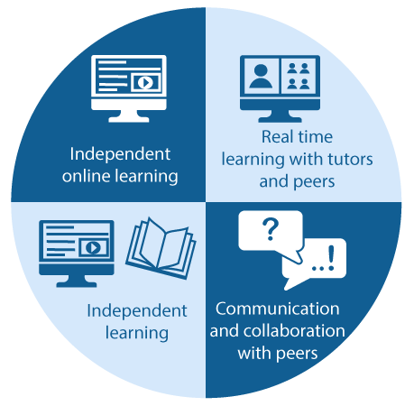

As an undergraduate student you are expected to spend 10 - 15 hours per week studying this unit including assessment. Each week in this unit you have the following learning opportunities:

Independent online learning, real time learning, communication and collaboration with peers and independent learning.

Your weekly pattern of learning commences with an announcement and is supported by an ongoing communication channel across the week using {{ INCLUDE RELEVANT TOOL: Slack / Microsoft Teams / Other }}. Each week you are expected to complete some online independent learning in the form of viewing pre-recorded lectures, engaging in activities and checking your understanding of key concepts prior to your real time learning class. The real time learning class allows you to ask your tutor questions, collaborate with others and apply your learning. After the real time class you might communicate and collaborate with peers, undertake additional independent learning, or complete assessment tasks. At the end of the week, a brief summary of the week will be posted to your Canvas site.