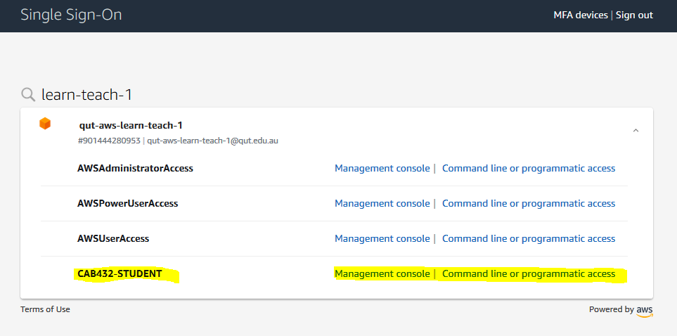
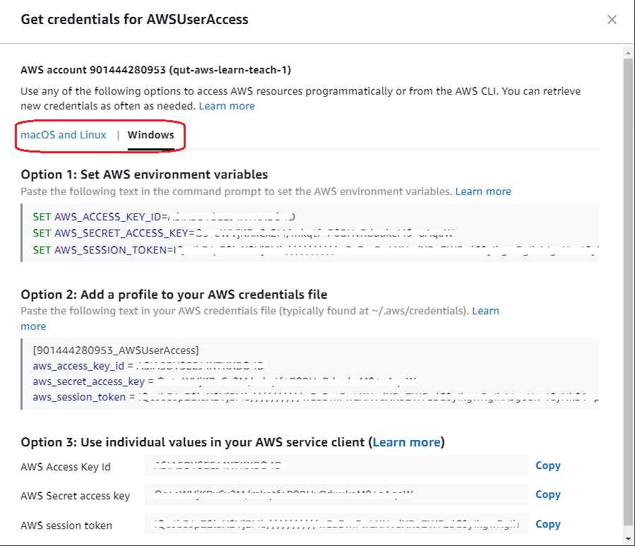

#### Section Overview

This guide will show you how to log onto the QUT managed AWS service.

#### References
- [https://d-97671c4bd0.awsapps.com/start#/](https://d-97671c4bd0.awsapps.com/start#/)

#### How-To Guide

1. Navigate to the AWS SSO via [https://d-97671c4bd0.awsapps.com/start#/](https://d-97671c4bd0.awsapps.com/start#/).  QUT uses Single Sign-On technology (SSO) for our Cloud environments so depending on your browser session you will end up at step 2 or step 4.

<!-- (The SSO link can also be accessed via [https://myapps.microsoft.com/](https://myapps.microsoft.com/) under _AWS SSO_) -->

2. Please input your full email address if you have not signed into QUT from this browser session. You will be asked to enter your QUT Credentials. Don't get confused by the Microsoft splash screen! QUT uses Microsoft's Azure Active Directory for this stage of the authentication.

3. Please Enter QUT Credentials and login.

4. You will be redirected to the AWS SSO page. Click on the _AWS Account_ drop down and select _qut-aws-learn-teach-1_. AWS Accounts are a logical container for AWS Resources - where we can create and manage AWS Resources. QUT has multiple AWS Accounts for different purposes. For this course we will be using the _qut-aws-learn-teach-1_ account.

1. Select the account and you can login to the account with different access levels. For instance, a CAB432 student will select _CAB432_STUDENT_. You can now select either _AWS Console_ or _Command Line or programmatic access_.

6. If you select _Management console_ you will be redirected to the AWS Console (This is the Portal/GUI method). You can now select the service you want to use. For instance, if you want to use the EC2 service, you can select EC2 from the _Find Services_ search bar. Your user details and region appear in the top right hand corner. Ensure you are in the Sydney region, or your builds won't work.

7. If you select _Command Line or programmatic access_ you will be presented three options to access AWS environment programmatically. Note: Environment variables provide another way to specify configuration options and credentials, and can be useful for scripting or temporarily setting a named profile as the default. You now have three options for accessing the AWS environment programmatically:

- Option 1 - Set environment variables to contain the credentials;
- Option 2 - Create or edit your AWS credentials file (See more in the next section);
- Option 3 - Use the credentials directly (required by some services such as Bitbucket Pipelines, et al).

