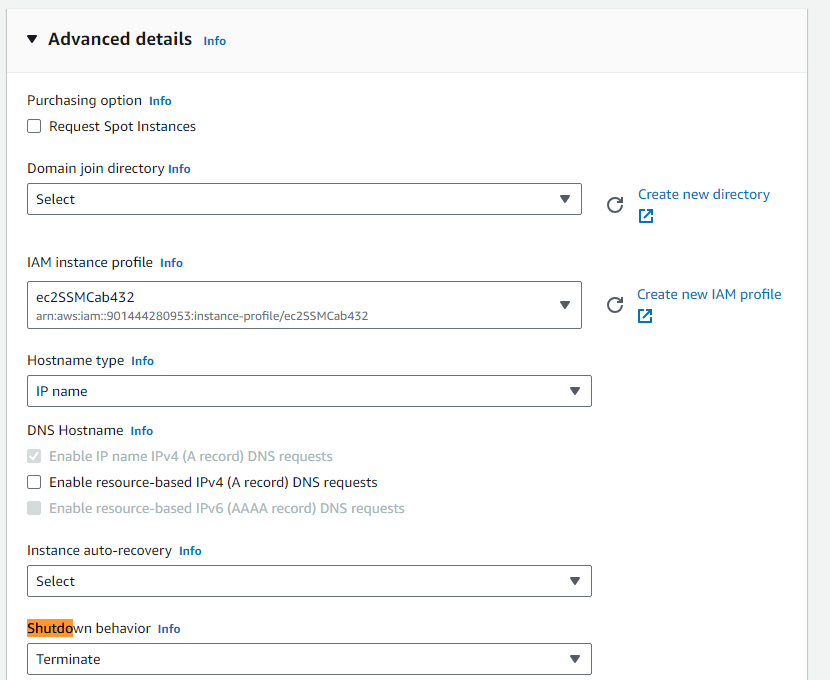

#### Section Overview

This guide will show you how to create an EC2 instance in AWS via the user portal (AWS Console). EC2 instance will be the Virtual Machines (VM's) we will be using throughout the course.

QUT have followed the AWS well architected framework to configure your workspace so there are a few things we have to work with.

#### References

- [AWS what is an EC2 (VM) ](https://aws.amazon.com/ec2/)
- [AWS guide on building an EC2](https://aws.amazon.com/getting-started/launch-a-virtual-machine-B-0/)
- [AWS well architected framework](https://aws.amazon.com/architecture/well-architected/)

#### Prerequisites

- **Access to AWS**: Please see previous guide on how to access AWS.
- **AWS Console**: You can access the AWS Console to build the EC2 instance from the AWS Management Console. [https://ap-southeast-2.console.aws.amazon.com/console/home?region=ap-southeast-2#](https://ap-southeast-2.console.aws.amazon.com/console/home?region=ap-southeast-2#)

#### How-To Guide

1. Login to AWS. Ensure your AWS Region is set to Sydney (ap-southeast-2). You can do this by clicking on the region in the top right hand corner of the AWS Console. If you are not in the Sydney region, please change to Sydney.

2. On the search bar (Shortcut via Alt + S), type in EC2 and select the EC2 service. Click launch instance.

3. In this page, we will be defining our parameters and configuration for our EC2 instance. Please use the following configurations

- **[Name]** You can name your EC2 instance whatever you like. Some common conventions include `ec2-RegionCode-EnvironmentCode-ApplicationCode`.
- **[Name]** We require Tags to be set in your deployment. A tag with key `qut-username` must be used, matching up with your QUT username.

- **[OS]** We will be using the Ubuntu 22.04 LTS AMI (Amazon Machine Image) for this course. Other images are fine but at your own risk. 
- **[OS]** 64-bit (x86) Architecture is fine.
- **[Spec]** t2.micro for instance type. This defines the spec of your VM. 

- **[Network]** We accept the default for the VPC as this keeps us in the environment created for us.
- **[Network]** In this prac we are creating a webserver which needs to connect to the internet so we need to create our VM in any of the public subnets.
- **[Network]** Later in the prac we will be enabling a simple HTTP web server on this VM so we will need a public IP created for us. Select enable in the drop down. __The selection defaults to private Subnet. Make sure to change to any of the public subnets__.
- **[Network]** On this screen we need to assign some existing security groups click the “select existing security group” radio button & then select the `CAB432SG` __and__ the `SsmEndpointSG`. As you might have guessed from the names one is creating access to our VM from our local computer using AWS systems manager while the other is opening ports to connect via the web browser which we will do later in this prac.
- **[Storage]** We will accept the defaults. Block storage of 8gb seems tiny but is more than adequate for this exercise. We do not require a massive data store in many cases, especially if our work is largely about the processing of streaming data or simple content provision. Still, EBS should be seen as a local disk drive rather than as repository, and it will die with the machine later.

- **[Additional]** We now must add an IAM role, again you will learn more about IAM later in the semester, for now just know that this IAM role will allow the VM to connect to the AWS systems manager service.  
- **[Additional]** Lastly we should change the default shutdown behaviour to terminate rather than to stop.  Even in a stopped state VM’s cost money so whenever possible you should get used to terminating (destroying) your VM’s after you’ve finished using it.

Finally, we are in a position to review the settings for the instance, which we do, and to push the launch button. This does not in fact launch… there is more than one way to connect to an AWS VM in the QUT cloud service 

If you need to download a key or not is dependent on the option you choose. If this is the first time you have created an AWS VM, create and download a private access key (which you save as a.pemfile). The key can be used in the next step to establish a remote connection to the VM.

The Launch Instances button becomes available, and we are indeed ready to launch. Scroll down on the resulting page and you will see a View Instances button in the bottom right hand corner.

1. You’ll probably seem a huge number of VM’s listed on the instances screen. To make it easier to find yours add the tag column into the view.  Click on the cog in the top right hand corner, tick the qut-username box on the left & close.  Now you can look for your username in the second column.  

#### Further Details: Subnets

QUT (CAB432) is using the Public subnets in the three availability zones to provide NAT Gateway, Load balancing services in each availability zones. 

A security best practice consideration as outlined in the AWS Well Architected Framework (Apply security at all layers) is to apply a defence in depth approach with multiple security controls. Apply to all layers (for example, edge of network, VPC, public subnets, private subnets, load balancing, security groups, every instance and compute service, operating system, application, and code).

**What is an Public Subnet?**

Subnet: A segment of a VPC’s IP address range that is associated with a route table that can have a direct route to an Internet gateway. This connects the VPC to the Internet and to other AWS services. Things like webservers, where access from users via internet is required will be placed in the public subnet.

Later in the prac we will be enabling a simple HTTP web server on this VM so we will need a public IP created for us. Select enable in the drop down.

**What is an Private Subnet?**

Subnet: A private subnet is a subnet that is associated with a route table that doesn’t have a route to an internet gateway. Instances in the private subnet are backend servers they don’t accept the traffic from the internet. EC2's, Web apps, Databases, Lambda functions in private subnets, these can't send outbound traffic directly to the Internet, this is only done via a NAT Gateway in the public subnet.

The following diagram provides an overview between how private and public subnets are used together. The VPC has public subnets and private subnets in two Availability Zones. Each public subnet contains a NAT gateway and a load balancer node. The servers run in the private subnets, are launched and terminated by using an Auto Scaling group, and receive traffic from the load balancer. The servers can connect to the internet by using the NAT gateway. The servers can connect to Amazon S3 by using a gateway VPC endpoint.

**Bastion Host**
But what if we want some sort of access from the internet to our private resources? We can deploy bastion hosts to provide temporary and/or limited access to private resources in a virtual private cloud (VPC). Bastion hosts typically sit in public subnets, with hardened security control, and act as a "jump" box.

#### Further Details: Security Group

QUT (CAB432) is using the security groups (CAB432SG, SsmEndpointSG) to provide a default list of ports for EC2 instances created in CAB432 and the security group SsmEndpointSG to provide connectivity to the EC2 instance via Systems Manager / Sessions Manager.

**What is a Security Group?**

A security group acts as a virtual firewall for your EC2 instance to control inbound and outbound traffic. When you launch an instance in a VPC, you can assign up to five security groups to the instance. Security groups act at the instance level, not the subnet level. Therefore, each instance in a subnet in your VPC can be assigned to a different set of security groups.

If you launch an instance, it is automatically assigned to the default security group for the VPC. If you launch an instance using the Amazon EC2 console, you have an option to create a new security group for the instance or utilise a defined security group for the workload.

For each security group, you add rules that control the inbound traffic to instances, and a separate set of rules that control the outbound traffic.

#### Further Details: Common Errors

**Error1**: Cannot find instance post deployment/access.

- Please ensure you have South East Asia (Sydney) selected as your region. If you are still having issues please contact your instructor.

**Error2**: Deployments are failing

- Please ensure you have South East Asia (Sydney) selected as your region. If you are still having issues please contact your instructor.
- Ensure you pick t2 micro instance size. Only certain sizes of VM's are allowed
- Make sure you have tagged your instance. There is a tagging policy enforced throughout our environment meaning: no tag no build **AND** tag must match qut-username – if it doesn’t you won’t be able to terminate or connect to your VM
- Subnet possible issue - You must have chosen one of the private subnets
- IAM role issue - You must choose the IAM role _ec2SSMCab432_

